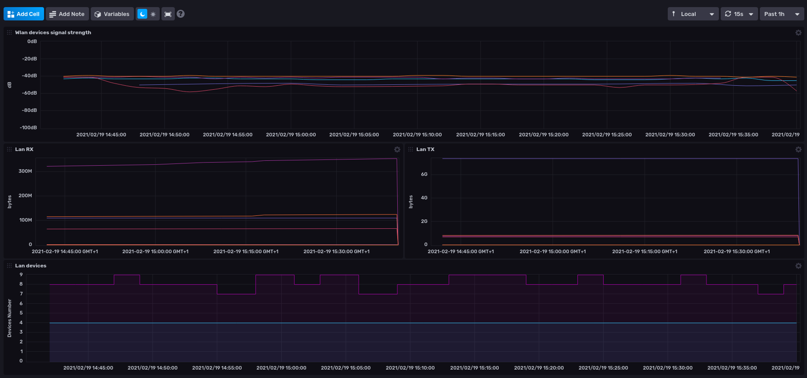

# sfr box scraper


A cli tool to scrape your SFR box web UI.

## Installation

### NPM package

Checkout the packages section of the repo.

### Docker image

Checkout the packages section of the repo too :smile:.

> If you are not able to run the docker image hosted on ghcr.io, I'm also publishing the docker image on [hub.docker.com](https://hub.docker.com/r/roukien/sfr-box-scraper).

## Usage

By default, the scraper will only run once then stop.
You can schedule the execution by adding the `--interval 10m` option to export metrics every 10 minutes.

```shell
sfr-box-scraper collect -h
```

### Configuring the box authentication

Copy the `.env.dist` to `.env` with your custom box settings or define the corresponding environment variables.

## Configuration

sfr-box-scraper is only able to push metrics to an influxdb 2.x backend for now.

## Supported models

| Model | Firmware version |
| --- | --- |
| NB6V2-FXC-r0 | NB6V2-MAIN-R3.5.8 |

## Dashboard

Here's an influxdb 2 OSS dashboard example that I built from the metrics:


